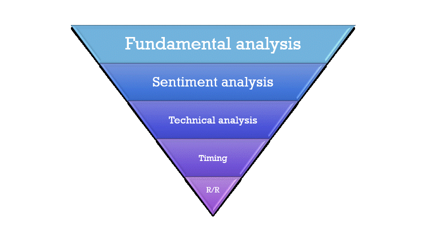

# Trading & Investment on German index "DAX40"
https://www.jfbl.me/Projects.html

## 🔸 To start

Repo to group some tools and analyses I've done in order to invest on the DAX40.
Content:
- Analysis
- Tools
- Algorithmes
- Exploration Data
- Prediction

## 🔸 Strategy

- First of all, a classic study of its characteristics, history and main metrics is required.
[Explorating Data Analysis for DAX40](https://github.com/jfbl369/Trading_German_index_DAX/blob/main/EDA-DAX.ipynb)

- Afterwards I base my analysis and my trading/investment strategies on the following postulates: 
I analyze the market, its characteristics, history and key metrics. Then I carry out a macroeconomic analysis of its environment (GDP, unemployment, IPC, etc.). 
- Then, I analyze the national, European and world sentiment data to determine the bullish or bearish bias in line with my previous economic analysis.

- Once I've determined my bias, I look for an entry point via technical analysis and in line with the technical analysis, I set-up the entry with the best possible timing.

- Finally, once all my parameters have been calculated and mastered, I analyze the risk/reward to determine whether it's worth entering in the market.

## 🔸 Tools

- [Economic news alarm](https://github.com/jfbl369/Trading_German_index_DAX/blob/main/Timer_Alarm_Economics_news.ipynb)
- [Fear & Greed Dax index](https://github.com/jfbl369/Trading_German_index_DAX/blob/main/DAX%26FG_V2.ipynb)
- Sentiment retail visualization
- [German economic tools webscrapping](https://github.com/jfbl369/Trading_German_index_DAX/blob/main/Macro_flow.pdf)
- [Economic data saving on Google drive server](https://github.com/jfbl369/Trading_German_index_DAX/blob/main/API_drive5.PNG)
- [Predictions](https://www.jfbl.me/Projects.html)

## 🔸 Sources

| Name | Website |
| ------ | ------ |
| European commission | https://economy-finance.ec.europa.eu/index_en |
| Boerse Frankfurt | https://www.boerse-frankfurt.de |
| ECB Data Portal | https://data.ecb.europa.eu |
| Deustch Bank API | https://www.bundesbank.de/en |
| OECD | https://data.oecd.org |
| Haver | https://www.haver.com |
| CNN-F&G | https://edition.cnn.com/markets/fear-and-greed |
| McClellans | https://www.mcoscillator.com |
| FED| https://www.federalreserve.gov |
| Wall Street Journal | https://www.wsj.com/market-data |
| Macro axis | https://www.macroaxis.com |
| American Association of Individual Investors | https://www.aaii.com |
| U.S. Bureau of Labor Statistics | https://www.bls.gov |
| The World Bank | https://datacatalog.worldbank.org |
| Bureau of Economic Analysis | https://www.bea.gov |
| Bank of International Settlements | https://www.bis.org |

